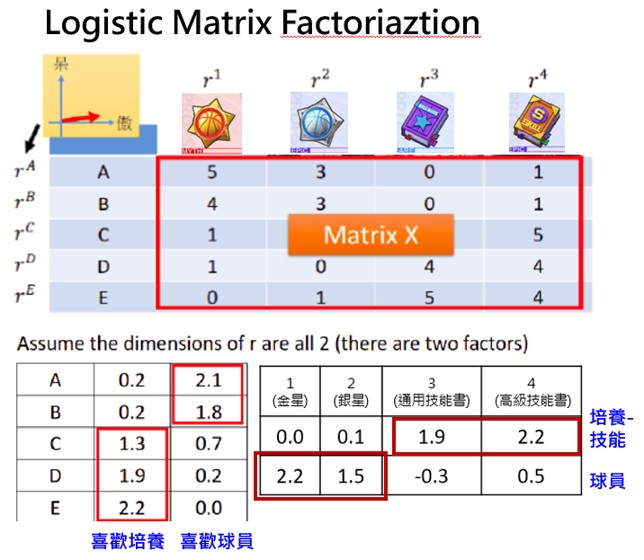
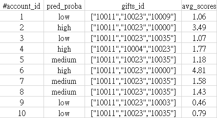

# Free-Player-Pack-Recommendation
Developed a personalized pack recommendation model for free players, leveraging Logistic Matrix Factorization (LFM) to suggest tailored starter packs.

### 專案簡介 | Project Overview
本專案開發了一個 個性化推薦模型，針對免費玩家提供 破冰禮包，以提升 付費轉換率。  
透過 Logistic Matrix Factorization (LFM) 矩陣分解 技術，分析玩家行為並推薦最適合的禮包，鼓勵首次消費並培養長期付費習慣。  
推薦禮包的 觀看率為 10%，其中 2.8% 的玩家完成購買，後續付費率達 60%，並帶動整體營收提升 0.83%。

This project developed a personalized recommendation model to offer starter packs to free players, aiming to increase conversion rates.  
Using Logistic Matrix Factorization (LFM), the model analyzes player behavior and recommends the most suitable packs, encouraging initial purchases and fostering long-term spending habits.  
The recommended packs achieved a 10% view rate, with 2.8% of players making a purchase. Among buyers, 60% continued spending, contributing to an overall revenue increase of 0.83%.

---

### 主要目的 | Main Purpose
針對免費玩家提供 高CP值 的 客製化禮包，促使玩家完成首次消費，並進一步推動後續付費行為，建立穩定的長期消費習慣。

Providing high-value personalized packs for free players to encourage their first purchase, drive continued spending, and establish a stable long-term payment habit.

---

### 輸出結果 | Output Results
1. **model.pkl**  
   已訓練完成的模型，可放入 user_for_predict.py 產生的玩家跟道具消耗矩陣 進行預測（檔案未包含，因模型屬於敏感資料）。  
   The trained model file, used for predictions via predict.py. It can also be backed up on MLFlow (not included in GitHub due to sensitivity concerns).  
2. **recommend_result.csv**  
   為每位免費玩家推薦三項商品，並標註推薦力度（高/中/低）。若需要還可進一步新增 A/B 測試組別以評估不同推薦策略的效果。   
   Recommend three products for each free player, along with an assigned recommendation strength (high, medium, or low). Optionally, an A/B test group can be added to evaluate different recommendation strategies.
     

---

### 各檔案描述 | File Descriptions

- **model.py**  
  使用免費玩家的鑽石消耗矩陣建立LFM模型，最後上傳至 MLflow：
  1. 根據所有鑽石消費數據建立模型。
  2. 擷取當日上線但未曾付費的玩家資料，並根據其過去的鑽石消耗紀錄，預測其可能購買的鑽石商品，該預測商品為玩家從未購買過的。
  3. 對預測出的鑽石商品進行分類。
  4. 輸出每個玩家的 3 項可能購買商品類別。
  5. 後端系統根據商品類別，推薦應該推薦的付費商品。
  6. 在測試模式下，將 user_for_predict.py 的資料進行預測處理。
  
  Build an LFM model using the diamond consumption matrix of free players, and upload the best model to MLflow:
  1. Build a model based on all diamond consumption data.
  2. Fetch the data of players who logged in on the current day but have not made any purchases, and predict the diamond products they might purchase based on their past diamond consumption records. The predicted products are those the player has never purchased before.
  3. Categorize the predicted diamond products.
  4. Output the top 3 predicted product categories for each playe。
  5. The backend system uses the product categories to recommend the appropriate paid products.
  6. In test mode, predict based on the data from user_for_predict.py.
    
- **user_for_predict.py**  
  撈取昨天有上線且7天內未領取過推薦禮包的免費玩家資料，為後續使用 model.py 進行商品推薦提供基礎的玩家與道具消耗的矩陣。  
  Get data of free players who logged in yesterday and have not received any recommended packs in the past 7 days, providing the foundational player-item consumption matrix for subsequent product recommendations using model.py.
  
